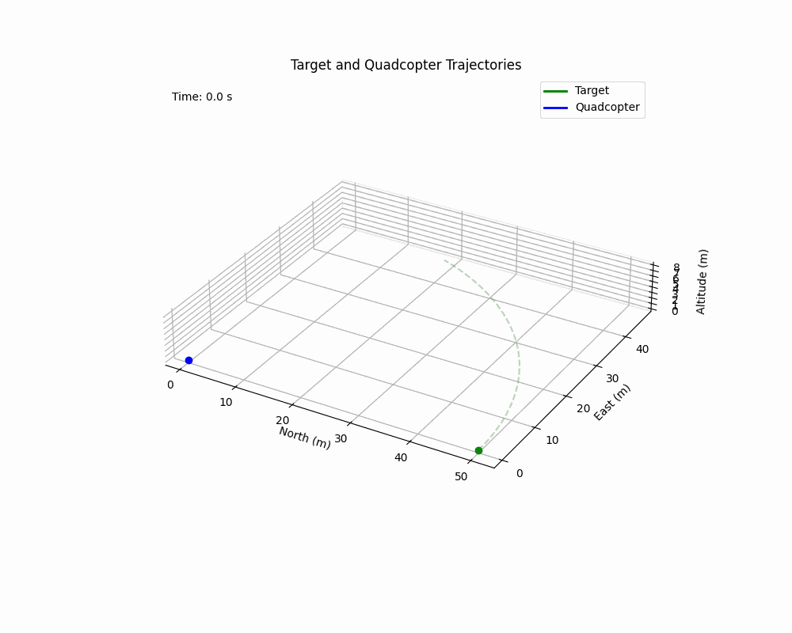
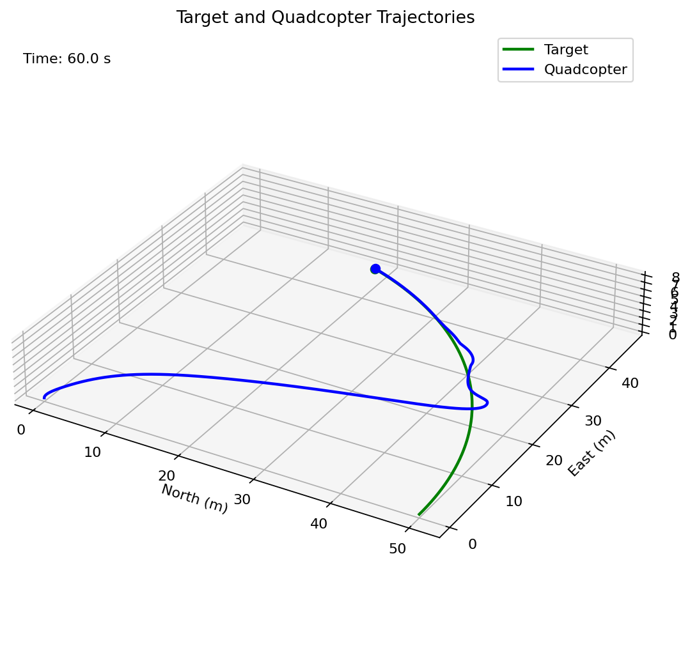
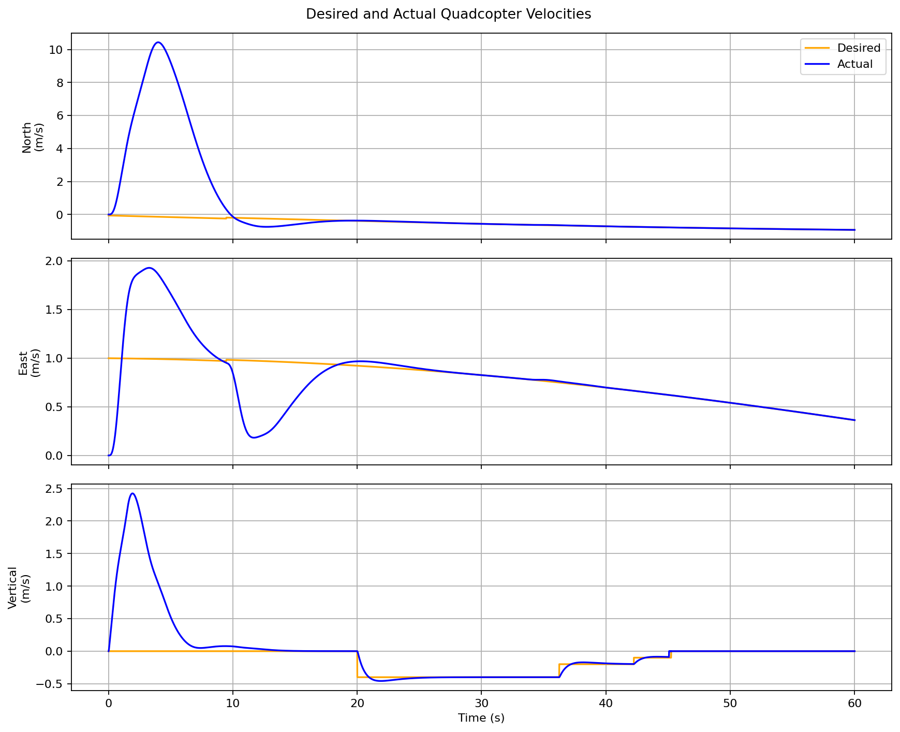

# Quadcopter Controller Simulation

This repository contains a standalone C++ simulation of a quadcopter intercepting and landing on a target moving around a 50-meter-radius circle at 1 m/s.

The simulation uses a 16-element state vector containing Euler attitude, angular velocity, NED position, NED velocity, and four motor states. The controller waits for horizontal capture, removes target look-ahead, and then follows a staged vertical descent profile while maintaining lateral control through touchdown.

## Results

- Touchdown time: 45.08 seconds
- Horizontal touchdown error: 0.058 meters
- Relative horizontal touchdown speed: 0.00115 m/s
- Downward touchdown speed: 0.089 m/s
- Maximum altitude: 7.9996 meters for an 8-meter command
- Horizontal error at 60 seconds: 0.0576 meters







## Files

- `Controller_Sim.cpp` contains the controller and aircraft simulation.
- `plot_controller_sim.py` creates the interactive 3D animation, static trajectory plot, velocity plots, and optional GIF.
- `controller_sim.csv` is the generated 60-second simulation output.
- `controller_trajectory.gif` is the rendered 3D animation.
- `controller_trajectory.png` and `controller_velocities.png` are the generated plots.

## Build and run

Run these commands from the repository directory:

```powershell
g++ -std=c++17 -O2 Controller_Sim.cpp -o Controller_Sim.exe
.\Controller_Sim.exe
python -m pip install -r requirements.txt
python plot_controller_sim.py
```

To regenerate the GIF:

```powershell
python plot_controller_sim.py --save-animation
```

The C++ simulation writes `controller_sim.csv`. Position is modeled in North-East-Down coordinates; the plotting script converts the Down position and velocity components into altitude and upward velocity.
